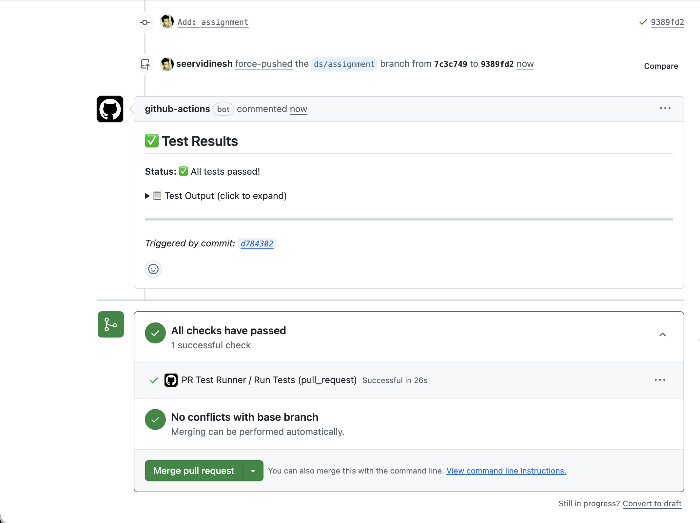

# My List API

A NestJS-based RESTful API for managing user watchlists, allowing users to save and organize their favorite movies and TV shows.

## Features

- **Add to List**: Save movies or TV shows to your personal watchlist
- **Remove from List**: Remove items from your watchlist
- **View List**: Retrieve paginated list of saved content
- **Duplicate Prevention**: Automatically prevents duplicate entries
- **Input Validation**: Comprehensive request validation

## Tech Stack

- **Framework**: NestJS 11
- **Database**: MongoDB with Mongoose
- **Documentation**: Swagger/OpenAPI
- **Testing**: Jest (Unit & E2E)
- **Containerization**: Docker & Docker Compose

## Prerequisites

- Node.js 18+ 
- npm or yarn
- MongoDB 7+ (or Docker)
- Docker & Docker Compose (optional, for containerized setup)

## Setup & Installation

### 1. Clone the repository

```bash
git clone <repository-url>
cd <app_folder>
```

### 2. Install dependencies

```bash
npm install
```

### 3. Configure environment variables

Create a `.env` file in the root directory:

```env
APP_HOST=0.0.0.0
APP_PORT=3000
MONGODB_URI=mongodb://localhost:27017/mylist
```

### 4. Start MongoDB

**Option A: Using Docker Compose (Recommended)**

```bash
docker compose up -d mongodb
```

**Option B: Local MongoDB installation**

Ensure MongoDB is running on `localhost:27017`

### 5. Seed the database

Populate the database with sample users, movies, and TV shows:

```bash
npm run seed
```

## Running the Application

### Development mode (with hot reload)

```bash
npm run start:dev
```

The API will be available at `http://localhost:3000`

## API Documentation

Swagger documentation is available at: `http://localhost:3000/docs`

### API Endpoints

All endpoints are prefixed with `/api/v1/`

| Method | Endpoint | Description |
|--------|----------|-------------|
| POST | `/my-list` | Add item to list |
| DELETE | `/my-list/:contentId` | Remove item from list |
| GET | `/my-list` | Get paginated list items |

### Authentication

All endpoints require the `x-user-id` header with a valid user ObjectId.

## Running Tests

### Unit Tests

```bash
npm run test
```

## CI/CD

A GitHub Actions workflow runs automatically on pull requests to `main`:

- Runs all tests with coverage report
- Posts test results as a PR comment
- Blocks merge if tests fail



## Design Choices

### Performance & Scalability

- **Database Indexing**: Compound unique index on `{userId, contentId}` for fast lookups and duplicate prevention
- **Parallel Queries**: `Promise.all()` for concurrent execution of independent database operations
- **Pagination**: Skip/limit pagination to handle large lists efficiently
- **Modular Architecture**: Feature-based modules allow independent scaling and easy microservices extraction

### Data Model

- Separate `MyList` collection instead of embedding in User document to avoid document size limits and enable efficient pagination